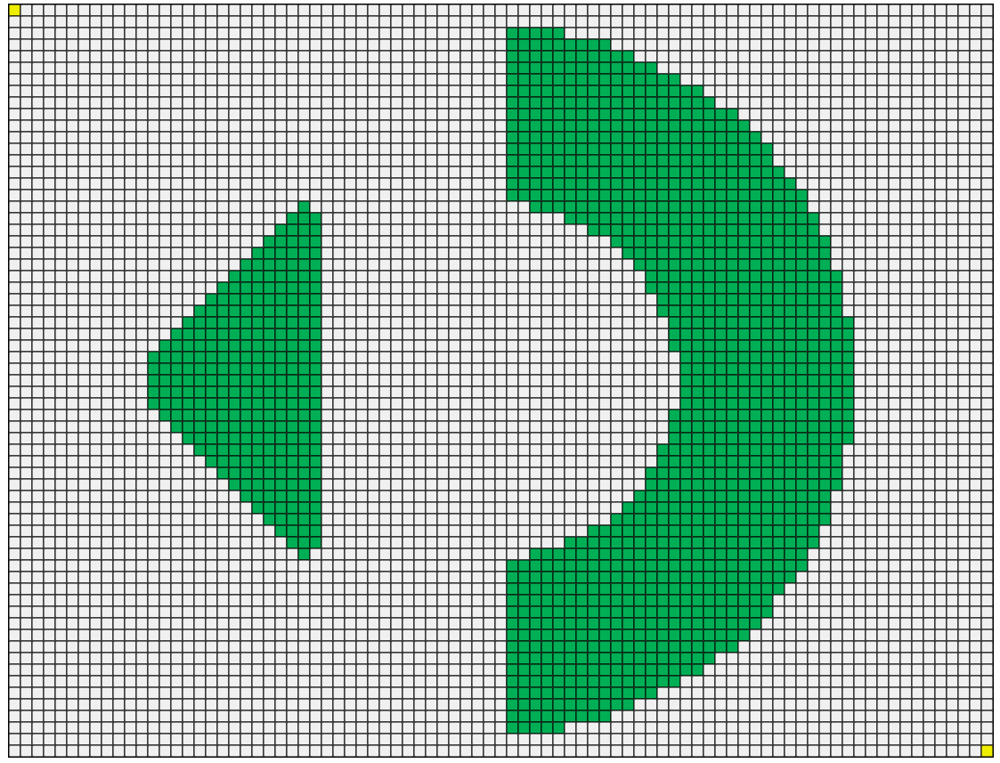
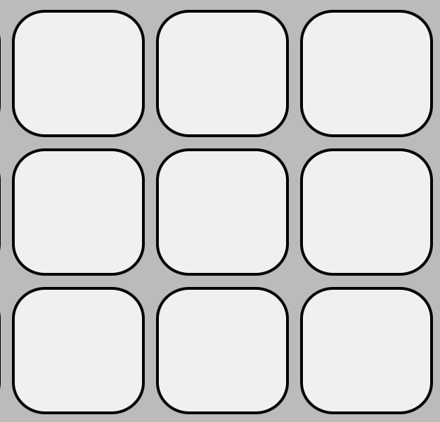

# Stone Challenge Sigma Geek

## Challenge 2

 

Você terá que percorrer um autômato cuja matriz possui 65 linhas e 85 colunas, conforme a figura abaixo:

 

 

Como seria praticamente impossível resolver manualmente, você deve atacar esse problema usando algoritmos e código de programação.

Para esta fase, o modelo de propagação é o seguinte: As células brancas ficam verdes se tiverem um número de células verdes adjacentes maior que 1 e menor que 5. Caso contrário, elas permanecem brancas.

As células verdes permanecem verdes se tiverem um número de células adjacentes verdes maior que 3 e menor que 6. Caso contrário, elas se tornam brancas.

Duas células são consideradas adjacentes se tiverem uma borda, seja na lateral, acima, abaixo ou na diagonal. No exemplo abaixo, a célula branca no centro possui 8 células brancas adjacentes.

 

 

A configuração inicial da matriz, ou seja, a cor de cada célula no início, está representada num ficheiro que deverá descarregar, que tem as seguintes características: Um ficheiro de texto codificado em formato UTF-8. O arquivo de texto contém 65 linhas. Cada linha contém 85 valores inteiros separados por um espaço em branco seguido por um caractere de nova linha **"\n"**. Esses valores representam os estados das células em uma matriz com 65 linhas e 85 colunas.

O valor "3" representa o ponto de partida, o valor "4" representa o ponto de destino. O valor "0" representa uma célula branca e o valor "1" uma célula verde.

Cada linha no arquivo representa uma linha da matriz e cada valor de linha representa o valor de uma célula nessa linha. O primeiro valor no arquivo representa o canto superior esquerdo da matriz.

 

Use o link abaixo para baixar o arquivo:

[**Baixar conjunto de dados**](./assets/docs/stone-challenge2-input.txt)

 

Agora que você tem a configuração inicial da matriz, a tarefa de encontrar um caminho por este labirinto está em suas mãos e você deve enviar sua resposta de acordo com as instruções abaixo.

 

ENVIO DA SOLUÇÃO

Você deve enviar um arquivo de texto de uma única linha contendo todos os movimentos da partícula desde o ponto inicial até o ponto de destino.

Cada movimento deve ser separado por um espaço em branco. Cada letra representa um movimento da partícula e, consequentemente, uma atualização do tabuleiro.

U - movimento para cima

D - movimento para baixo

R - movimento para a direita

L - movimento para a esquerda

 

A partícula inicia seu movimento no estado atual e termina seu movimento após a atualização do tabuleiro. A partícula nunca deve terminar seu movimento em uma célula verde.

Exemplo de resposta hipotética com 10 jogadas: RRDRDLUDRR
